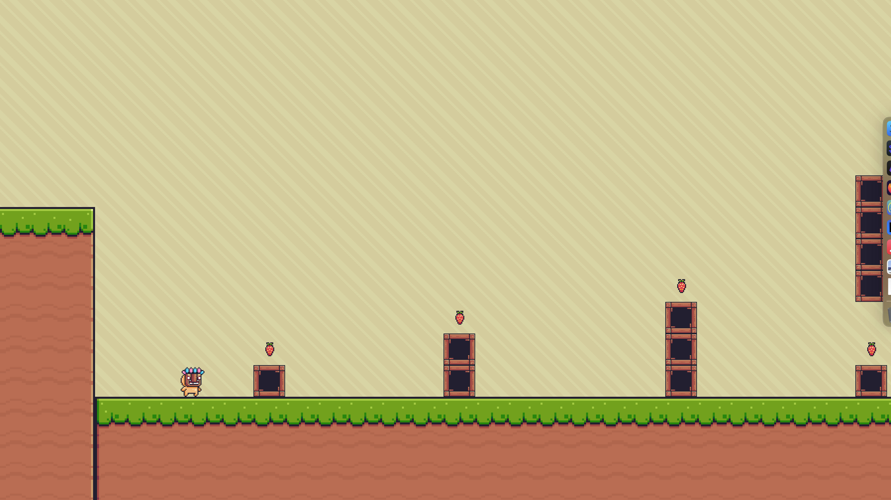

# Strawberry Platformer

A 2D platformer built with Kotlin and Raylib to help people new to gaming learn the ropes.

Collect all the Strawberries in each level and reach the flag to advance. Features 9 levels and support for keyboard and controller input.

## Controls

| Action | Keyboard | Controller |
|--------|----------|------------|
| Move | A / D | D-pad or left stick |
| Jump | W | A button |
| Quit | Escape | - |

## Attributions

- SFX — [kronbits.itch.io/freesfx](https://kronbits.itch.io/freesfx)
- Sprites
  - Inputs — [juliocacko.itch.io/free-input-prompts](https://juliocacko.itch.io/free-input-prompts)
  - Game — [pixelfrog-assets.itch.io/pixel-adventure-1](https://pixelfrog-assets.itch.io/pixel-adventure-1)
